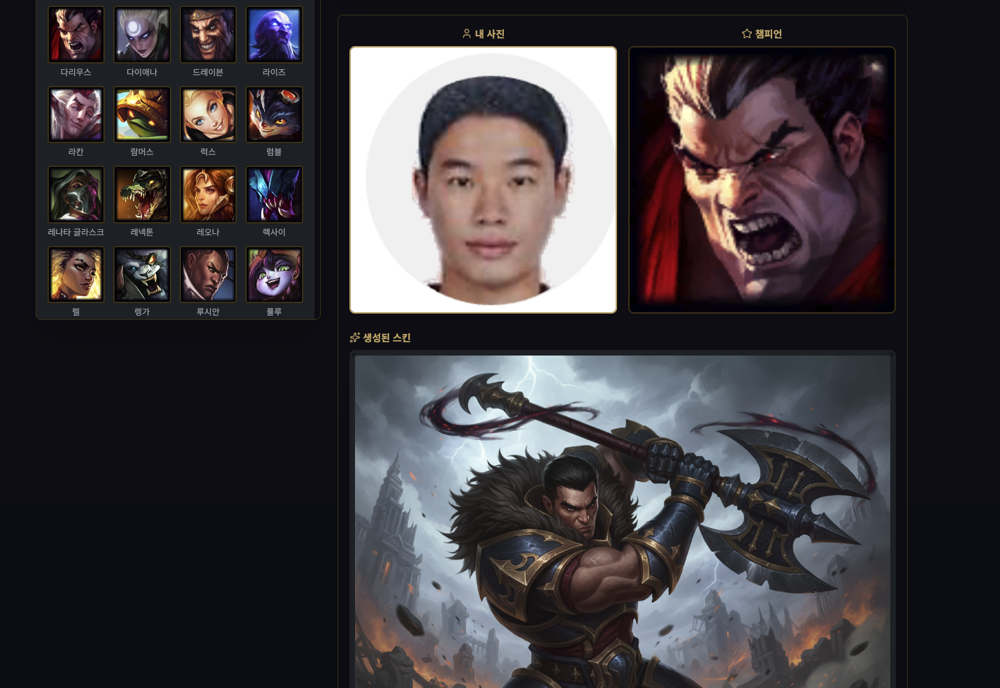

# LoL Skin Maker 🎮✨

사용자가 업로드한 사진을 이용해 League of Legends(롤) 커스텀 스킨을 생성하는 웹 애플리케이션입니다.



## 🌟 주요 기능

- **챔피언 선택**: 리그 오브 레전드의 모든 챔피언 중 원하는 챔피언 선택
- **사진 업로드**: 자신의 사진 업로드
- **스킨 생성**: 
  - 로컬 이미지 처리 방식 (Sharp 라이브러리)
  - 나노바나 API 연동 (선택사항)
- **이미지 다운로드**: 생성된 스킨 이미지 다운로드
- **실시간 미리보기**: 불투명도 조절을 통한 실시간 미리보기

## 📋 기술 스택

### 프론트엔드
- HTML5, CSS3 (Tailwind CSS)
- JavaScript (ES6+)
- Lucide Icons
- Canvas API (이미지 합성)

### 백엔드
- Node.js + Express.js
- Multer (파일 업로드)
- Sharp (이미지 처리)
- Axios (HTTP 요청)
- Dotenv (환경 변수 관리)

## 🚀 설치 및 실행

### 필수 요구사항
- Node.js 14.0 이상
- npm 또는 yarn

### 1. 저장소 클론
```bash
cd lol-skin-maker
```

### 2. 패키지 설치
```bash
npm install
```

### 3. 환경 변수 설정
`.env` 파일을 생성하고 다음과 같이 설정합니다:

```env
# Nanobanana API Configuration (선택사항)
NANOBANA_API_KEY=your_api_key_here

# Server Configuration
PORT=3000
NODE_ENV=development
```

> **참고**: 나노바나 API는 선택사항입니다. API 키가 없으면 로컬 이미지 처리 방식으로 자동 전환됩니다.

### 4. 서버 실행

**개발 모드** (자동 재시작):
```bash
npm run dev
```

**프로덕션 모드**:
```bash
npm start
```

### 5. 브라우저에서 접속
```
http://localhost:3000
```

## 🎨 사용 방법

1. **챔피언 선택**: 왼쪽 패널에서 원하는 챔피언을 검색하고 선택
2. **사진 업로드**: "내 사진 업로드" 영역에 사진 드래그 또는 클릭
3. **미리보기**: 슬라이더로 불투명도 조절하여 효과 미리보기
4. **스킨 생성**: "스킨 생성하기" 버튼 클릭
5. **다운로드**: 생성된 스킨 이미지 다운로드

## 🔌 API 엔드포인트

### POST `/api/generate-skin`
사용자의 사진으로부터 스킨을 생성합니다.

**요청**:
```
Content-Type: multipart/form-data

Parameters:
- image (file): 업로드할 이미지 파일
- champion (string): 챔피언 이름
```

**응답**:
```json
{
  "success": true,
  "message": "스킨이 성공적으로 생성되었습니다.",
  "filename": "skin_1234567890_Ahri.png",
  "url": "/uploads/skin_1234567890_Ahri.png",
  "size": 125000,
  "champion": "Ahri",
  "timestamp": "2024-11-20T10:30:00Z"
}
```

### GET `/api/health`
서버 상태 확인

**응답**:
```json
{
  "status": "ok",
  "apiKey": "설정됨",
  "timestamp": "2024-11-20T10:30:00Z"
}
```

## 📂 프로젝트 구조

```
lol-skin-maker/
├── index.html              # 메인 페이지
├── server.js              # Express 서버
├── image-processor.js     # 이미지 처리 유틸리티
├── package.json           # 프로젝트 설정
├── .env.example           # 환경 변수 예시
├── .gitignore            # Git 무시 파일
├── README.md             # 프로젝트 설명
├── uploads/              # 생성된 이미지 저장 디렉토리
└── node_modules/         # 의존성 패키지
```

## 🛠️ 이미지 처리 파이프라인

1. **이미지 정규화**: 입력 이미지를 308x560 크기로 조정
2. **LoL 스킨 스타일 적용**: 
   - 밝기 조정 (1.1x)
   - 포화도 증가 (1.3x)
   - 색상 회전 (20도 - 따뜻한 톤)
3. **LoL 테마 적용**: 
   - 황금색 테두리 추가
   - 챔피언 이름 텍스트 추가
   - "CUSTOM SKIN" 라벨 추가

## 🔐 보안 고려사항

- ✅ 파일 유형 검증 (이미지만 허용)
- ✅ 파일 크기 제한 (최대 10MB)
- ✅ 경로 검증 (디렉토리 접근 제한)
- ✅ 임시 파일 자동 삭제
- ✅ API 키는 환경 변수로 관리

## 🌐 나노바나 API 연동

나노바나 API를 사용하는 경우 더욱 고급스러운 스킨 생성이 가능합니다.

### 나노바나 API 키 발급
1. [나노바나](https://nanobana.com) 웹사이트 방문
2. 계정 생성 및 로그인
3. API 키 발급 (개발자 콘솔)
4. `.env` 파일에 `NANOBANA_API_KEY` 추가

### API 자동 페일오버
- 나노바나 API가 실패하면 자동으로 로컬 이미지 처리로 전환
- 사용자 경험 저하 없음

## 📝 로깅

서버 실행 시 다음과 같은 로그가 표시됩니다:

```
╔════════════════════════════════════╗
║   LoL Skin Maker 서버 시작        ║
╠════════════════════════════════════╣
║ 포트: 3000                    
║ 주소: http://localhost:3000
║ API 키: ✓ 설정됨
╚════════════════════════════════════╝
```

## 🐛 트러블슈팅

### 포트 3000이 이미 사용 중인 경우
```bash
PORT=3001 npm start
```

### 이미지 처리 오류
- 이미지 형식 지원: JPEG, PNG, GIF, WebP
- 최대 파일 크기: 10MB
- 지원하지 않는 형식의 경우 오류 메시지 표시

### 나노바나 API 오류
- API 키 확인
- 인터넷 연결 확인
- 로컬 처리로 자동 전환됨

## 📄 라이선스

MIT License


## 📞 지원

문제가 발생하면 이슈를 등록하세요.

---

**즐거운 스킨 제작 되세요!** ✨🎮

